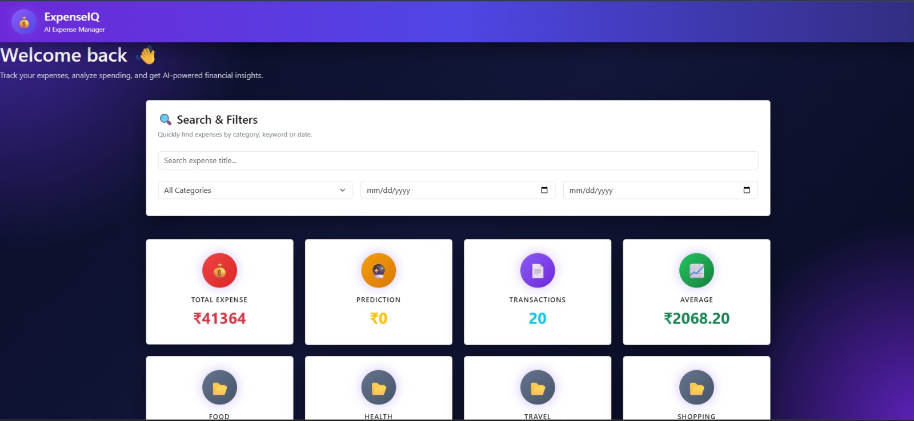
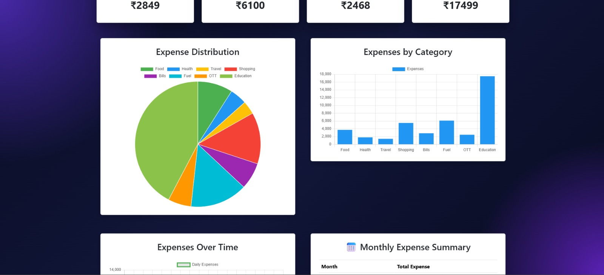
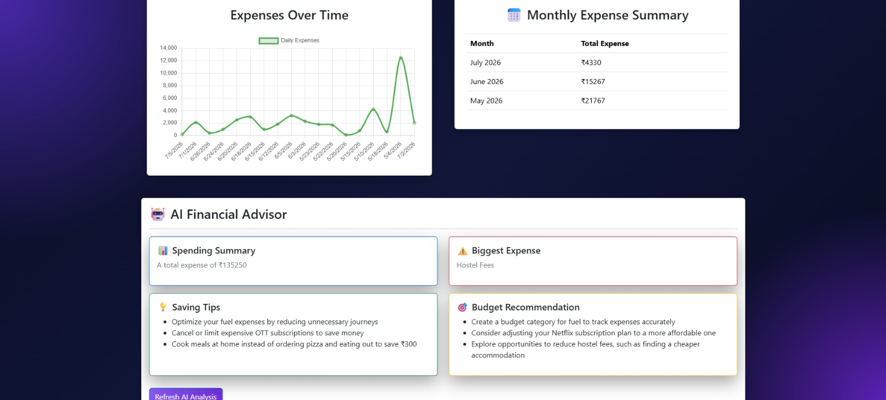
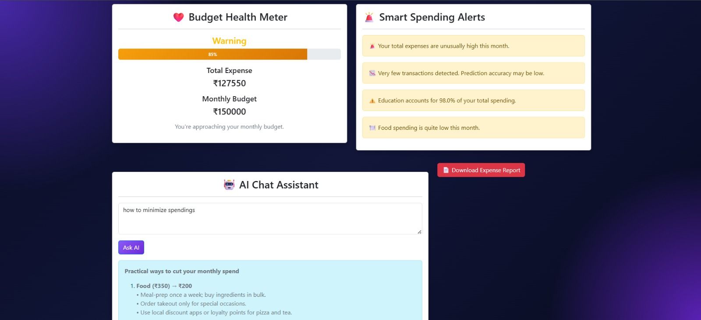
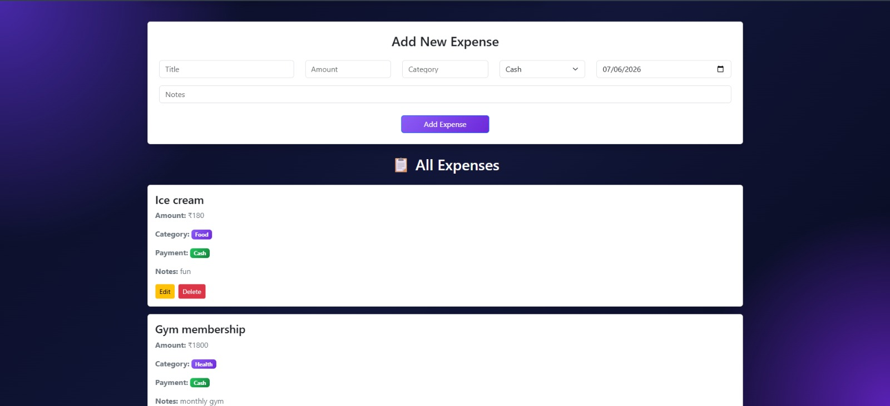
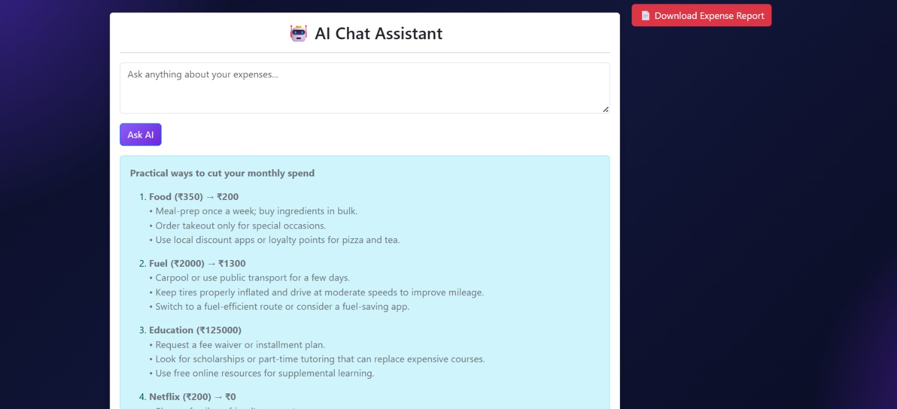
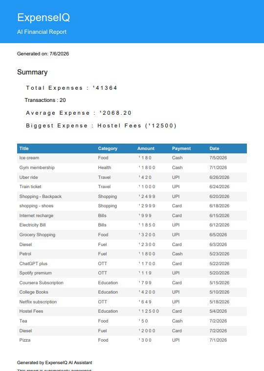

# 💰 ExpenseIQ – AI Powered Personal Finance & Expense Management System




---

## 📌 Project Overview

ExpenseIQ is an AI-powered personal finance management system designed to help users track expenses, analyze spending patterns, visualize financial data, receive AI-driven recommendations, predict future expenses using Machine Learning, and generate downloadable PDF reports.

Built using the MERN Stack, FastAPI, Machine Learning, and Groq AI, ExpenseIQ provides an intelligent and interactive way to manage personal finances.

---

# 🚀 Features

### 💳 Expense Management
- Add, Edit and Delete expenses
- Categorize expenses
- Payment method tracking
- Date-wise expense recording

### 🔍 Smart Search & Filters
- Search expenses by title
- Filter by category
- Filter by date range

### 📊 Interactive Dashboard
- Total Expenses
- Average Expense
- Total Transactions
- Category-wise summaries

### 📈 Data Visualization
- Pie Chart (Expense Distribution)
- Bar Chart (Category-wise Expenses)
- Line Chart (Expenses Over Time)
- Monthly Expense Summary

### 🤖 AI Features
- AI Financial Advisor
- AI Spending Insights
- Budget Recommendations
- Smart Spending Alerts
- AI Chat Assistant (Powered by Groq)
- Next Month Expense Prediction using Machine Learning

### 📄 Reports
- Generate downloadable PDF Financial Report

### ❤️ Budget Analysis
- Budget Health Meter
- Overspending Alerts
- Spending Recommendations

---

# 🛠 Tech Stack

## Frontend
- React.js
- Bootstrap 5
- Axios
- Framer Motion
- Chart.js
- React Chart.js 2

## Backend
- Node.js
- Express.js

## Database
- MongoDB Atlas
- Mongoose

## Artificial Intelligence
- Groq LLM
- Python
- FastAPI
- Scikit-Learn

---

# 📂 Project Structure

```text
ExpenseIQ/
│
├── client/              # React Frontend
├── server/              # Express Backend
├── python/              # FastAPI & ML Services
├── screenshots/         # README Images
├── README.md
├── .gitignore
└── .env.example
```

---

# 📸 Screenshots

## Dashboard


---

## Analytics Dashboard



---

## AI Financial Advisor



---

## Smart Spending Alerts



---

## Expense Management



---

## AI Chat Assistant



---

## PDF Financial Report



---

# ⚙️ Installation

## Clone Repository

```bash
git clone https://github.com/Mohammad-Rehan-Ahmed/ExpenseIQ.git
```

---

## Frontend

```bash
cd client
npm install
npm run dev
```

---

## Backend

```bash
cd server
npm install
npm start
```

---

## AI Service

```bash
cd python

python -m venv venv

# Windows
venv\Scripts\activate

# Linux/macOS
source venv/bin/activate

pip install -r requirements.txt

uvicorn main:app --reload
```

---

# 🔑 Environment Variables

Create a `.env` file inside the **server** directory and add:

```env
MONGO_URI=your_mongodb_connection_string
GROQ_API_KEY=your_groq_api_key
```

Replace the values with your own credentials before running the project.

---

# 🌐 Default Ports

| Service | Port |
|----------|------|
| React | 5173 |
| Express | 5000 |
| FastAPI | 8000 |

---

# ✨ Key Highlights

- Full Stack MERN Application
- AI-Powered Expense Analysis
- Machine Learning Expense Prediction
- Interactive Dashboard
- Modern Responsive UI
- PDF Financial Report Generation
- Real-Time Data Visualization
- Smart Budget Monitoring
- AI Chat Assistant Powered by Groq

---

# 🔮 Future Enhancements

- User Authentication
- Multi-user Support
- Recurring Expenses
- Budget Goals
- Email Reports
- Cloud Image Uploads
- Dark/Light Theme
- Progressive Web App (PWA)

---

# 👨‍💻 Author

**Mohammad Rehan Ahmed**

📧 Email: rehanahmed631743@gmail.com

🔗 LinkedIn: https://www.linkedin.com/in/mohammad-rehan-ahmed-073850377

💻 GitHub: https://github.com/Mohammad-Rehan-Ahmed

---

# 🙏 Acknowledgements

Special thanks to the open-source community and the developers of:

- React
- Express.js
- MongoDB
- FastAPI
- Groq
- Chart.js
- Bootstrap
- Scikit-Learn

---

# 📄 License

This project is developed for educational and hackathon purposes.

---

# ⭐ Support

If you found this project useful, please consider giving it a ⭐ on GitHub!

Thank you for checking out **ExpenseIQ**.
